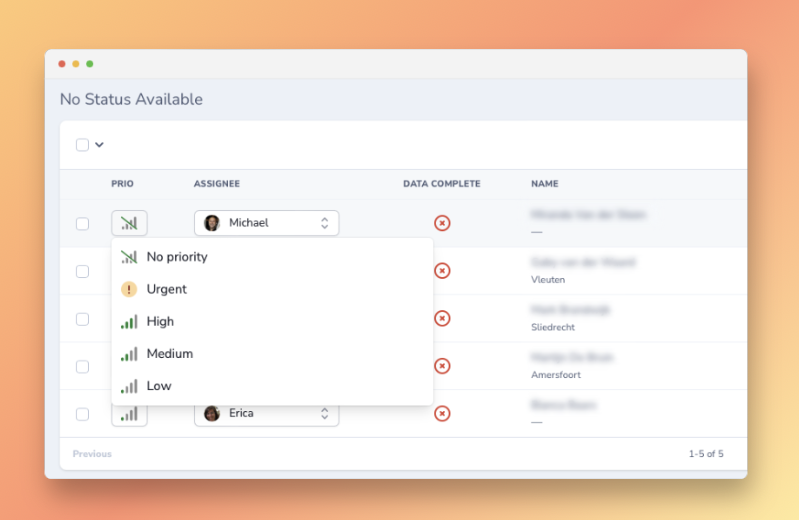

# Nova Inline Select

[](https://github.com/marshmallow-packages/nova-inline-select)
[](https://github.com/marshmallow-packages/nova-inline-select)
[](https://github.com/marshmallow-packages/nova-inline-select)

This package gives you the possibility to create an inline select field in Laraval Nova. This is build to make quick changes to your resource from the index or detail view. On forms it will just show you a normal select.



## Requirements

-   `php: >=8.1`
-   `laravel/nova: ^4.0`

## Installation

Install the package in a Laravel Nova project via Composer:

```bash
composer require marshmallow/nova-inline-select
```

## Usage

```php
use Marshmallow\NovaInlineSelect\NovaInlineSelect;

return NovaInlineSelect::make(__('Assignee'), 'assignee_id')->options([
    1 => 'Stef van Esch',
    2 => 'Lars Kort',
]);
```

## Avatar / Icons

```php
use Marshmallow\NovaInlineSelect\NovaInlineSelect;

return NovaInlineSelect::make(__('Assignee'), 'assignee_id')
    ->options([
        1 => 'Stef van Esch',
        2 => 'Lars Kort',
    ])
    ->avatarImages([
        1 => 'https://marshmallow.dev/stef.png',
        2 => 'https://marshmallow.dev/lars.png',
    ]);
```

### With avatar HTML

In the case you wish to use some kind of HTML as the `avatar`, for instance an SVG icon, you can use the `avatarHtml()` method.

```php
use Marshmallow\NovaInlineSelect\NovaInlineSelect;

return NovaInlineSelect::make(__('Priority'), 'priority')
    ->options([
        'urgent' => 'Urgent',
        // ...
    ])
    ->avatarHtml([
        'urgent' => '<svg class="mm-h-5 mm-w-5 mm-flex-shrink-0">...</svg>',
        // ...
    ]);
```

### No avatar image

You can customize what kind of image we render if no avatar images is provided for an option. You can use the `noAvatarImage()` method for this.

```php
use Marshmallow\NovaInlineSelect\NovaInlineSelect;

return NovaInlineSelect::make(__('Priority'), 'priority')
    ->options([
        'urgent' => 'Urgent',
        // ...
    ])
    ->avatarHtml([
        'urgent' => '<svg class="mm-h-5 mm-w-5 mm-flex-shrink-0">...</svg>',
        // ...
    ])
    ->noAvatarImage('<svg class="mm-h-5 mm-w-5 mm-flex-shrink-0">...</svg>');
```

## Arrows

By default, arrows are shown in the select box to indicate a selection can be made. You can change the behaviour with the following methods.

```php
return NovaInlineSelect::make(__('Priority'), 'priority')
    ->showArrows()
    ->hideArrows()
    ->showArrowsOnIndex()
    ->hideArrowsOnIndex()
    ->showArrowsOnDetail()
    ->hideArrowsOnDetail();
```

## Labels

By default, the labels are shown in the select button. Sometimes you would want to hide this. In our preview image on top of this page, we have hidden the labels for the priority field, but kept it for the assignee field. You can do this with the following methods.

```php
return NovaInlineSelect::make(__('Priority'), 'priority')
    ->showLabel()
    ->hideLabel()
    ->showLabelOnIndex()
    ->hideLabelOnIndex()
    ->showLabelOnDetail()
    ->hideLabelOnDetail();
```

## Styling

It is possible to set the max width of the select button on the index and detail view. In our preview image on the top of this page, we have made the priority field a lot smaller so it doesnt take up a lot af room on the index view.

```php
return NovaInlineSelect::make(__('Priority'), 'priority')
    ->maxWidthOnIndex('180px')
    ->maxWidthOnDetail('inherit');
```

## No option selected

By default, when no option is selected, the button will show the text `No option selected`. You can change this text with the method below.

```php
return NovaInlineSelect::make(__('Priority'), 'priority')
    ->noOptionSelected('No prio set');
```

## Validation caveats

In the case where fields on a model are `required`, which is likely, an extra step needs to be taken to ensure the inline select update persists and doesn't throw an error. The validation rule `sometimes` needs to be added to the `updateRules()` method on any field that is `required`.

```php
Text::make('Email')
    ->rules('required', 'email')
    ->updateRules('sometimes'),
```

## Credits

-   [Stef van Esch](https://github.com/stefvanesch)
-   [All Contributors](../../contributors)

## License

This project is open-sourced software licensed under the [MIT license](LICENSE.md).
